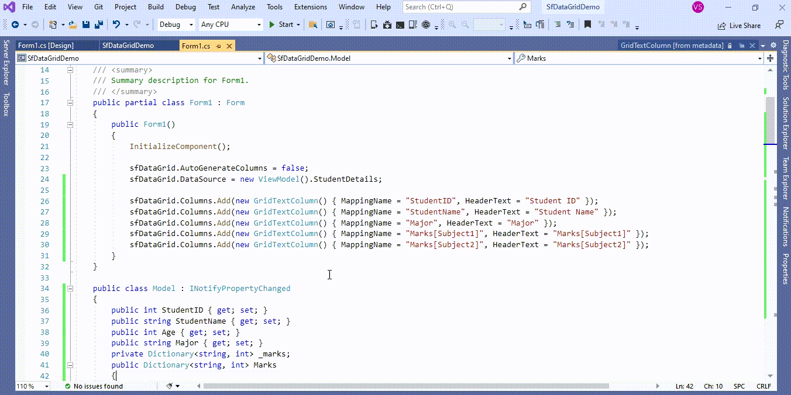

# How to bind dictionary to column in WinForms DataGrid (SfDataGrid)?

## About the sample
This example illustrates how to bind dictionary to column in [WinForms DataGrid](https://www.syncfusion.com/winforms-ui-controls/datagrid) (SfDataGrid)?

[WinForms DataGrid](https://www.syncfusion.com/winforms-ui-controls/datagrid) (SfDataGrid) provides support to bind the **Dictionary** with [SfDataGrid.Columns](https://help.syncfusion.com/cr/windowsforms/Syncfusion.WinForms.DataGrid.SfDataGrid.html#Syncfusion_WinForms_DataGrid_SfDataGrid_Columns).
In the below code snippet marks dictionary bound to [GridColumns](https://help.syncfusion.com/cr/windowsforms/Syncfusion.WinForms.DataGrid.GridColumn.html) by specifying the property name and key to [MappingName](https://help.syncfusion.com/cr/windowsforms/Syncfusion.WinForms.DataGrid.GridColumnBase.html#Syncfusion_WinForms_DataGrid_GridColumnBase_MappingName) of [GridColumn](https://help.syncfusion.com/cr/windowsforms/Syncfusion.WinForms.DataGrid.GridColumn.html).


```C#

sfDataGrid.AutoGenerateColumns = false;
sfDataGrid.DataSource = new ViewModel().StudentDetails; 

sfDataGrid.Columns.Add(new GridTextColumn() { MappingName = "StudentID", HeaderText = "Student ID" });
sfDataGrid.Columns.Add(new GridTextColumn() { MappingName = "StudentName", HeaderText = "Student Name" });
sfDataGrid.Columns.Add(new GridTextColumn() { MappingName = "Major", HeaderText = "Major" });
sfDataGrid.Columns.Add(new GridTextColumn() { MappingName = "Marks[Subject1]", HeaderText = "Marks[Subject1]" });
sfDataGrid.Columns.Add(new GridTextColumn() { MappingName = "Marks[Subject2]", HeaderText = "Marks[Subject2]" });

```

Below is the sample code snippet where Model is added with Dictionary property type (Marks property). You can bind value from dictionary by mapping its key with column.

```C#

var dictionary = new Dictionary<string, int>();
dictionary.Add("Subject1", 85);
dictionary.Add("Subject2", 96);

studentDetails = new ObservableCollection<Model>();

studentDetails.Add(new Model()
{
      StudentID = 101,
      StudentName = "Joseph",
      Age = 25,
      Major = "Psychology",
      Marks = dictionary,
});

```


The following screenshot shows bind the Dictionary with a column, 


Take a moment to peruse the [WinForms DataGrid – Data Binding](https://help.syncfusion.com/windowsforms/datagrid/databinding) documentation, where you can find about data binding with code examples.

## Requirements to run the demo
Visual Studio 2015 and above versions
